# Quick guide to binding a MadCap project to GitHub and troubleshooting

This guide will show you how to upload your MadCap project to GitHub for source control. It will also help you resolve the login issue.

## How to bind a MadCap project to GitHub

### Create a new repository

1. Open the GitHub page and create a new repository by clicking **New**.
   
    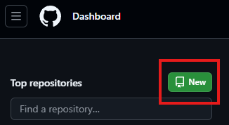

2. Enter your repository name, tick the **Add a README file** checkbox (optional) and click **Create repository**.
   
    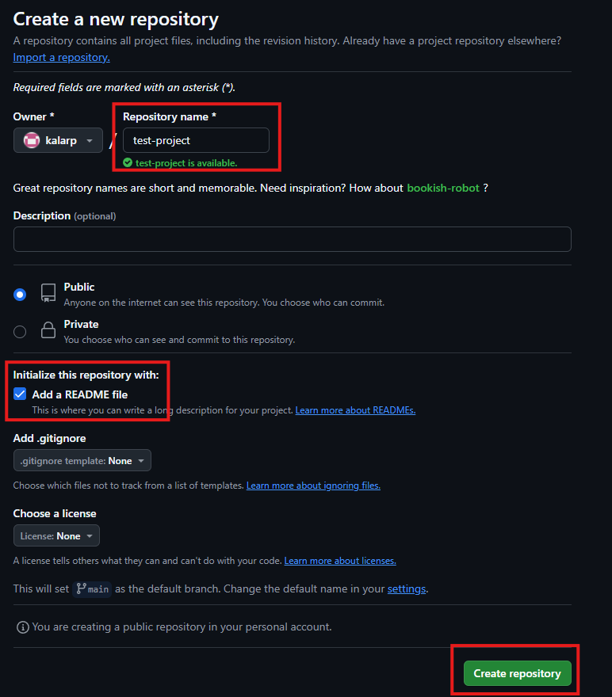

3. In the **code** section you will find the https address you will use to bind your MadCap project. Copy the address.

    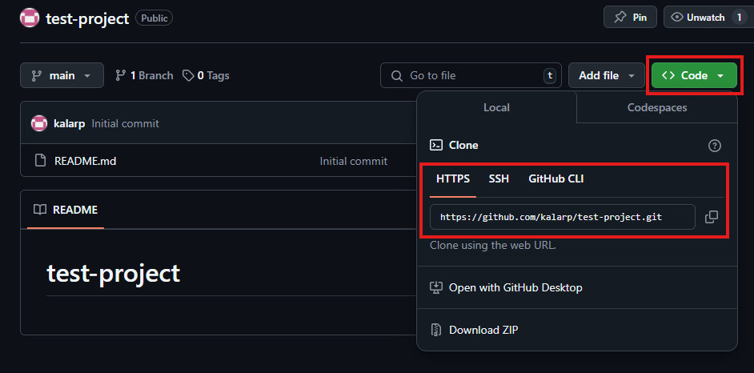

### Bind your project to GitHub

1. In MadCap Flare, open the project you want to bind.
2. From the **Project** menu, select **Project Properties**.

    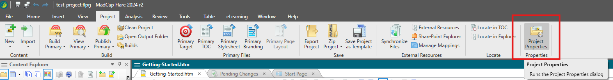

3. Select **Source Control** and click **Bind Project...**.

    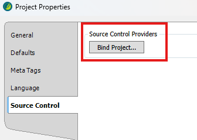

4. Select **Git** as your source control provider. Paste the https address you copied from GitHub. Tick the **Remote Repository** and **Push on bind** checkboxes. 

    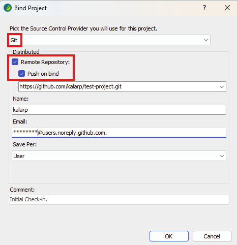

5. On the login screen, use your GitHub username and password. 

    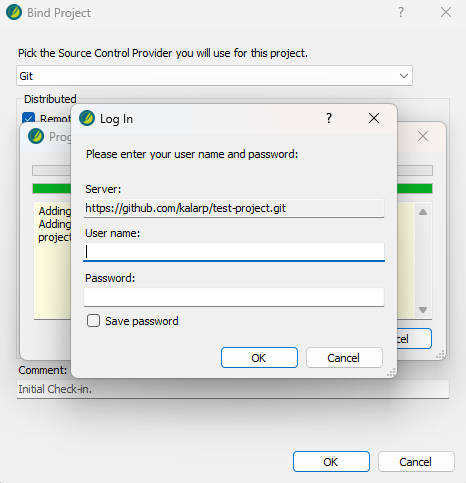

Your project has been uploaded to Git.

## Troubleshooting

### I can't log in to my GitHub account from MadCap Flare

If you find that every time you try to log in with your GitHub login and password, you keep returning to the login screen, try using personal tokens instead.

1. Go to the GitHub page. Click on your **profile picture** in the top right corner. 

    

2. Go to **Settings**.

    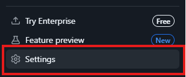

3. Next, go to **Developer settings**.

    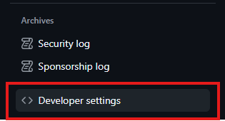

4. Select **Tokens (classic)**, click on **Generate new token** and select **Generate new token (classic)**.

    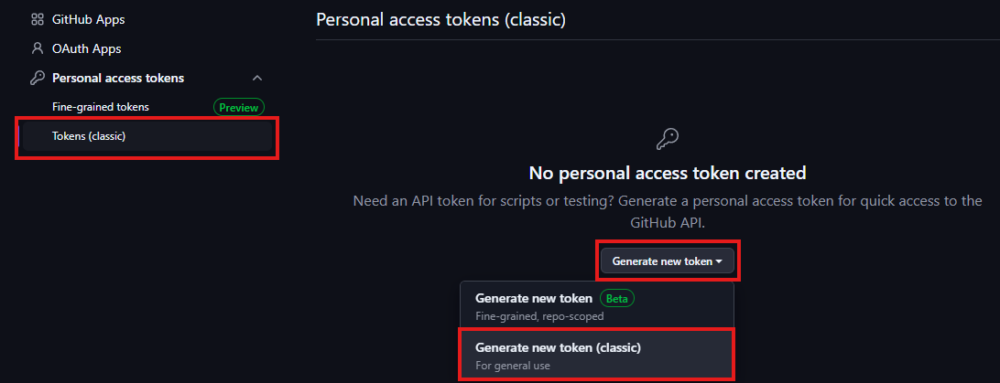

5. Confirm access by entering your password.
6. Name the token in the notes section. Set the expiration period. You can also select the access scopes. 

    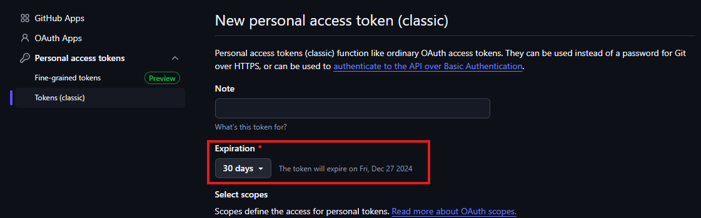

7. Click 
8. Copy your personal access token.
9. Use your personal access token in the password section of MadCap Flare.

    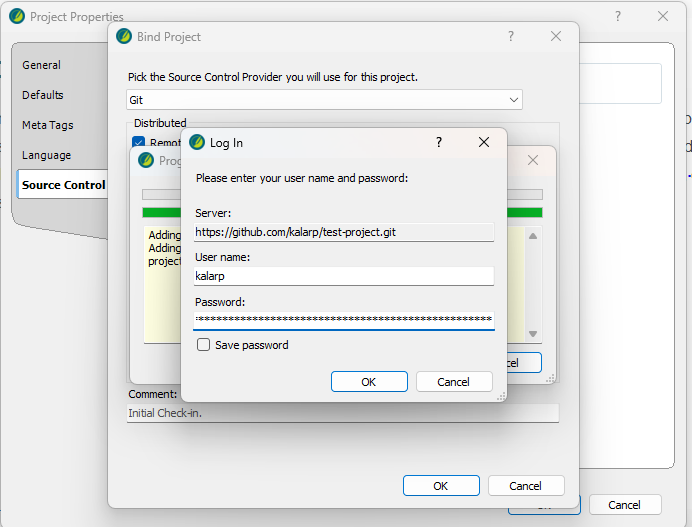

You should now be able to log in to your GitHub account from MadCap Flare.
